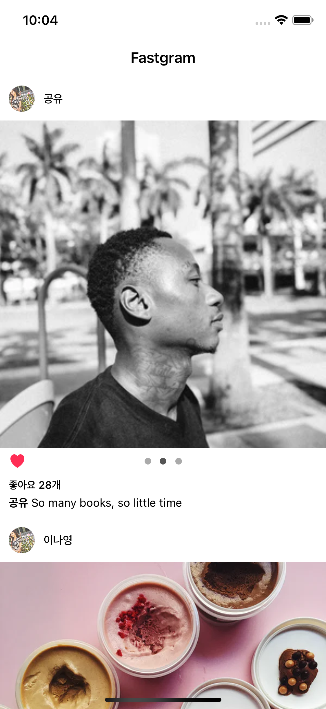
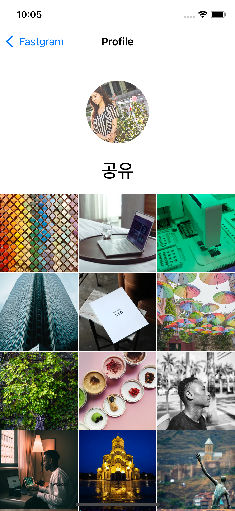

## 📸 Fastgram
인스타그램 메인화면의 클론앱을 만들어 본다. 
복잡한 UI 구현과 동영상을 재생하여 어떻게 제어하는지에 대해 알아본다.

## 강의 내용
- Cocoapods 을 이용하여 외부 라이브러리 사용해보기.
- UITableView 와 UICollectionView 를 이용하여 복잡한 화면 구현해보기
- 동영상 재생 및 제어 해보기
- 좋아요 액션 구현 및 데이터에 반영해보기
- 스크롤 해서 컨텐츠 더보기 구현해보기

## 최종화면
 

## 더 고민해봐야 할 사항
- 인스타그램의 릴스와 같은 화면은 어떻게 구현할 수 있을까?

### 링크
[첫화면으로 돌아가기](https://github.com/iwill-hwang/fastcampus-ios)
